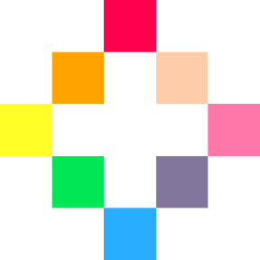
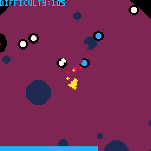
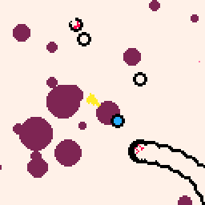
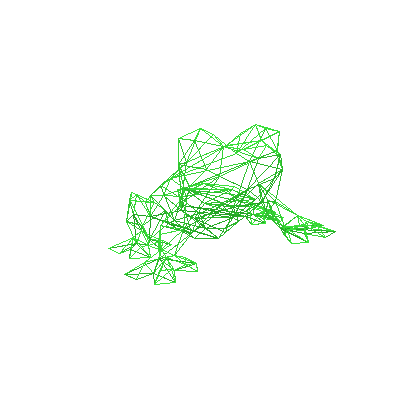
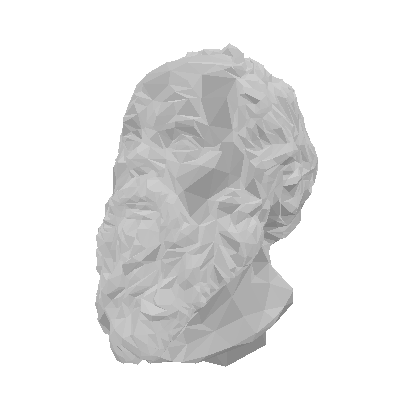
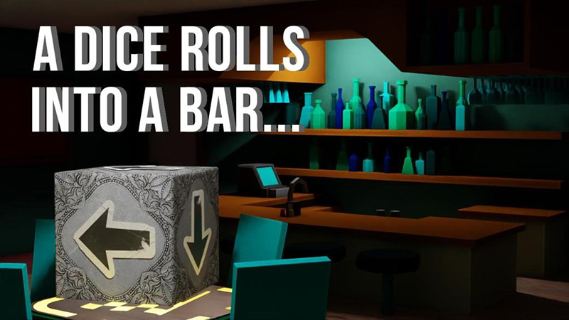
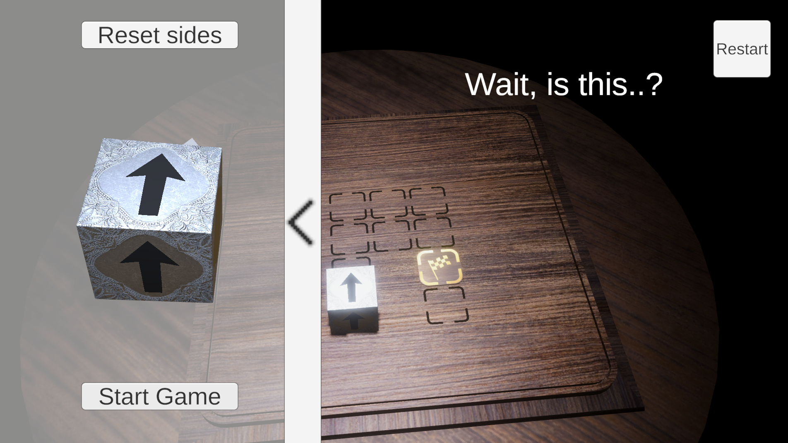

### Hey there 👋
## About me 👦

- Im a junior game developer/graphics programmer from Moscow, Russia. 
- Currently studying at Moscow State Technical University as a CAD developer.🧑‍🎓

### 🛠 &nbsp;Languages and Tools :

  
&nbsp;
&nbsp;
&nbsp;
&nbsp;
&nbsp;
&nbsp;
&nbsp;

## Recent projects

### (WIP) Cosmophidian
A [pico-8](https://www.lexaloffle.com/pico-8.php) movement-based 👾 *shmup* 👾 about killing snakes in space.

 \
Soon on ✨[itch.io](https://itch.io/)!\
⚡GH: [cosmophidian](https://github.com/nerisuyu/cosmophidian)

### Basic 3D Renderer
A small research project on linear algebra and matrix transformations

 \
The program is based on 2d engine [PyGame](https://www.pygame.org/) and visualizes STL models.\
⚡GH: [3d renderer](https://github.com/nerisuyu/pygame_3d_engine)

### 🎲 A Dice Rolls Into A Bar...
[GMTK GameJam 2022](https://itch.io/jam/gmtk-jam-2022) entry about rolling a die made in 48 hours.\
I worked on the visuals, sound design and music.🔊

&nbsp;
&nbsp;\
✨Itch.io page: [A Dice Rolls Into A Bar...](https://rembo51.itch.io/a-dice-rolls-into-a)\
🎵Soundtrack: [YT](https://youtu.be/SDezMVtSkho)

### (WIP) Arduino Based Car Climate Control

<!--
> sheesh
- 🔭 I’m currently working on COSMOPHIDIAN
- 🔭 I’m currently working on Climate Control For my Honda HR-V powered by Arduino 
- A Dice Rolls Into A Bar GMTK 2022 GameJam Entry
- ⚡3D visualizer based on Pygame2d⚡
- Climate Control 

*AAAAAAAAAAAAAAAAAAAAAAAAAAAAAAAAAAAAAAAAAAAAA*
**AAAAAAAAAAAAAAAAAAAAAAAAAAAAAAAAAAAAAAAAAAAAA**

**nerisuyu/nerisuyu** is a ✨ _special_ ✨ repository because its `README.md` (this file) appears on your GitHub profile.

Here are some ideas to get you started:

- 🔭 I’m currently working on ...
- 🌱 I’m currently learning ...
- 👯 I’m looking to collaborate on ...
- 🤔 I’m looking for help with ...
- 💬 Ask me about ...
- 📫 How to reach me: ...
- 😄 Pronouns: ...
- ⚡ Fun fact: ...
-->
