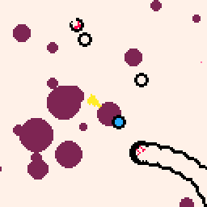

### Hey there 👋
## About me 

- Im a junior game developer/graphics programmer from Moscow, Russia. 🌱
- Currently studying at Moscow State Technical University as a CAD developer.

## Recent projects
### (WIP) Cosmophidian

A [pico-8](https://www.lexaloffle.com/pico-8.php) movement-based 👾 *shmup* 👾 about killing snakes in space.

 \
Soon on [itch.io](https://itch.io/)!⚡

> sheesh
- 🔭 I’m currently working on COSMOPHIDIAN
- 🔭 I’m currently working on Climate Control For my Honda HR-V powered by Arduino 
- A Dice Rolls Into A Bar GMTK 2022 GameJam Entry
- ⚡3D visualizer based on Pygame2d⚡
- Climate Control 

*AAAAAAAAAAAAAAAAAAAAAAAAAAAAAAAAAAAAAAAAAAAAA*
**AAAAAAAAAAAAAAAAAAAAAAAAAAAAAAAAAAAAAAAAAAAAA**
<!--
**nerisuyu/nerisuyu** is a ✨ _special_ ✨ repository because its `README.md` (this file) appears on your GitHub profile.

Here are some ideas to get you started:

- 🔭 I’m currently working on ...
- 🌱 I’m currently learning ...
- 👯 I’m looking to collaborate on ...
- 🤔 I’m looking for help with ...
- 💬 Ask me about ...
- 📫 How to reach me: ...
- 😄 Pronouns: ...
- ⚡ Fun fact: ...
-->
